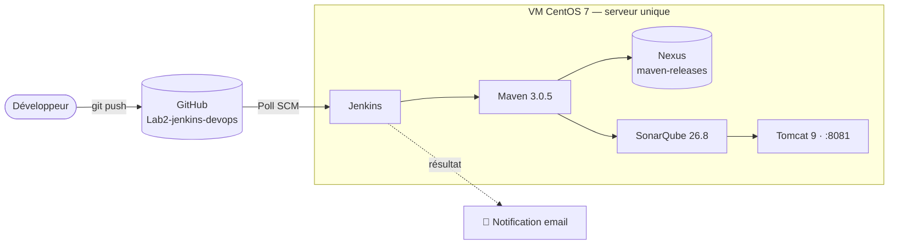
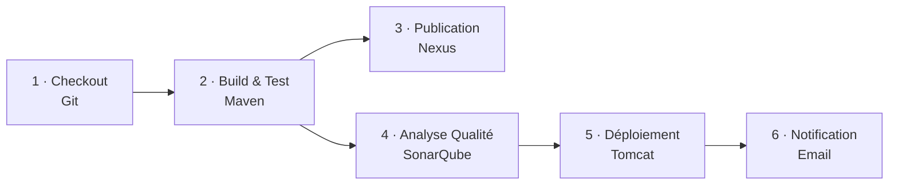

# Lab2 — Jenkins CI/CD Pipeline


Pipeline CI/CD complet orchestré par Jenkins : d'un `git push` à une application Java déployée et testée, avec analyse de qualité de code et notification automatique du résultat.

> Ce dépôt documente une chaîne d'intégration continue construite pas à pas dans le cadre de la formation DevOps Linqiny — Lab2. Chaque étape a été ajoutée, testée et débuggée individuellement avant d'être intégrée dans le pipeline final ci-dessous.

---

## Sommaire

- [Architecture](#architecture)
- [Stack technique](#stack-technique)
- [Structure du dépôt](#structure-du-dépôt)
- [Pipeline — vue d'ensemble](#pipeline--vue-densemble)
- [Détail des étapes](#détail-des-étapes)
- [Jenkinsfile complet](#jenkinsfile-complet)
- [Installation & reproduction](#installation--reproduction)
- [Incidents rencontrés & résolutions](#incidents-rencontrés--résolutions)
- [Bonnes pratiques appliquées](#bonnes-pratiques-appliquées)
- [Limites connues & roadmap](#limites-connues--roadmap)
- [Auteur](#auteur)

---

## Architecture



**Choix d'architecture assumé :** Jenkins, Maven, Nexus, SonarQube et Tomcat cohabitent sur une seule VM CentOS 7, plutôt que sur des VM séparées par rôle. Ce choix a été fait pour optimiser les ressources disponibles pendant la formation ; en environnement de production, ces composants seraient répartis sur des hôtes distincts (voire des conteneurs) pour isoler les pannes et scaler indépendamment.

## Stack technique

| Composant | Version | Rôle |
|---|---|---|
| Jenkins | 2.568.3 | Orchestrateur CI/CD |
| Maven | 3.0.5 | Build, tests, gestion des dépendances |
| Nexus Repository Manager | 3.70.4-02 | Dépôt d'artefacts (`maven-releases`) |
| SonarQube | 26.8.0 (Community) | Analyse statique de code |
| SonarQube Scanner CLI | 8.0.1.6346 | Exécution de l'analyse (standalone) |
| Apache Tomcat | 9.0 | Serveur d'exécution / déploiement |
| Java | 21 (Temurin) / 1.8 (cible de compilation) | Runtime Jenkins / compatibilité build |
| OS | CentOS Linux 7 | Système hôte |

## Structure du dépôt

```
Lab2-jenkins-devops/
├── Jenkinsfile              # Définition du pipeline (voir ci-dessous)
├── pom.xml                  # packaging=war, distributionManagement Nexus
├── install-jenkins.sh       # Script d'installation automatisée de Jenkins
├── src/
│   ├── main/
│   │   ├── java/            # Code source Java
│   │   └── webapp/
│   │       └── index.jsp    # Page servie par Tomcat après déploiement
│   └── test/
│       └── java/            # Tests unitaires (JUnit)
├── .gitignore
└── README.md
```

## Pipeline — vue d'ensemble



Chaque étape ne s'exécute que si la précédente a réussi. Un échec à n'importe quelle étape stoppe le pipeline et déclenche une notification d'échec — le code défaillant n'atteint jamais Tomcat.

## Détail des étapes

### 1. Checkout — Git
Jenkins surveille le dépôt (`Poll SCM`) et déclenche automatiquement un build à chaque commit sur `main`. Le code source est récupéré dans le workspace du job.

### 2. Build & Test — Maven
`mvn clean package` compile le code, exécute les tests unitaires (JUnit) et produit l'artefact `.war`. Le build échoue immédiatement si un test échoue — aucun artefact défaillant n'est produit.

### 3. Publication — Nexus
L'artefact validé est publié vers le dépôt `maven-releases` (`mvn deploy`), avec les coordonnées du dépôt déclarées dans `distributionManagement` (`pom.xml`) et les identifiants stockés dans `settings.xml` (jamais dans le dépôt Git).

### 4. Analyse qualité — SonarQube
Le code est analysé via le SonarQube Scanner (`withSonarQubeEnv`) : bugs, vulnérabilités, code smells et couverture de tests. Le résultat est visible sur le dashboard SonarQube du projet, avec un **Quality Gate** qui doit être respecté.

### 5. Déploiement — Tomcat
Le fichier `.war` généré est copié dans `webapps/` de Tomcat, qui le déploie et l'expose automatiquement. L'application est accessible immédiatement après le build.

### 6. Notification — Email
Un bloc `post { success {} failure {} }` envoie un email (SMTP Gmail, authentifié par mot de passe d'application) avec le statut du build et un lien direct vers les logs.

## Jenkinsfile complet

```groovy
pipeline {
    agent any

    stages {
        stage('Checkout') {
            steps {
                git branch: 'main',
                    url: 'https://github.com/ouledhmedmohamed-dotcom/Lab2-jenkins-devops.git'
            }
        }

        stage('Build & Test') {
            steps {
                sh 'mvn clean package'
            }
        }

        stage('Publish to Nexus') {
            steps {
                sh 'mvn deploy -DskipTests'
            }
        }

        stage('Code Quality Analysis') {
            steps {
                withSonarQubeEnv('SonarQube') {
                    sh '''
                        /opt/sonar-scanner/bin/sonar-scanner \
                          -Dsonar.projectKey=mon-projet-jenkins \
                          -Dsonar.sources=src \
                          -Dsonar.java.binaries=target/classes
                    '''
                }
            }
        }

        stage('Deploy to Tomcat') {
            steps {
                sh 'cp target/*.war /opt/tomcat/webapps/'
            }
        }
    }

    post {
        success {
            mail to: 'ouledhmedmohamed@gmail.com',
                 subject: "✅ SUCCÈS - Build #${env.BUILD_NUMBER} - ${env.JOB_NAME}",
                 body: "Le build #${env.BUILD_NUMBER} a réussi.\n\nDétails : ${env.BUILD_URL}"
        }
        failure {
            mail to: 'ouledhmedmohamed@gmail.com',
                 subject: "❌ ÉCHEC - Build #${env.BUILD_NUMBER} - ${env.JOB_NAME}",
                 body: "Le build #${env.BUILD_NUMBER} a échoué.\n\nDétails : ${env.BUILD_URL}"
        }
    }
}
```

> **Note :** `Publish to Nexus` et `Code Quality Analysis` ont été développées et validées comme chaînes indépendantes avant d'être combinées ici dans un pipeline unique. Selon le contexte, `mvn deploy` peut être limité à la branche `main` (`when { branch 'main' }`) pour éviter de publier un artefact à chaque commit de développement.

## Installation & reproduction

**Prérequis :** VM CentOS 7, accès `sudo`, connexion internet sortante.

```bash
# 1. Installer Jenkins (Java 21 + Jenkins, service systemd, port 8080)
curl -O https://raw.githubusercontent.com/ouledhmedmohamed-dotcom/Lab2-jenkins-devops/main/install-jenkins.sh
chmod +x install-jenkins.sh
sudo ./install-jenkins.sh

# 2. Installer le SonarQube Scanner CLI (standalone, indépendant de Maven)
sudo curl -L -o sonar-scanner-cli.zip \
  https://binaries.sonarsource.com/Distribution/sonar-scanner-cli/sonar-scanner-cli-8.0.1.6346.zip
sudo unzip sonar-scanner-cli.zip -d /opt/sonar-scanner
sudo mv /opt/sonar-scanner/sonar-scanner-*/* /opt/sonar-scanner/
sudo chmod +x /opt/sonar-scanner/bin/sonar-scanner

# 3. Installer Tomcat 9
cd /opt
sudo curl -L -o tomcat.tar.gz \
  https://dlcdn.apache.org/tomcat/tomcat-9/v9.0.106/bin/apache-tomcat-9.0.106.tar.gz
sudo tar -xzf tomcat.tar.gz && sudo mv apache-tomcat-9.0.106 tomcat
sudo chown -R jenkins:jenkins /opt/tomcat
sudo -u jenkins /opt/tomcat/bin/startup.sh
```

Configurer ensuite dans Jenkins : le serveur SonarQube (*Manage Jenkins → System*), le dépôt Nexus (`settings.xml`) et le serveur SMTP (*E-mail Notification*), puis créer un Pipeline Job pointant vers ce dépôt.

## Incidents rencontrés & résolutions

Documenter les incidents réels — pas seulement les étapes qui fonctionnent du premier coup — fait partie intégrante d'une chaîne CI/CD fiable. Voici les quatre incidents non triviaux rencontrés lors de la construction de ce pipeline :

| # | Incident | Cause racine | Résolution |
|---|---|---|---|
| 1 | `sonar-maven-plugin` échoue : `No implementation for SecDispatcher was bound` | Maven 3.0.5 (installé sur la VM) trop ancien pour le plugin Sonar moderne — incompatibilité Guice/Plexus | Installation du SonarQube Scanner CLI en **standalone** (`/opt/sonar-scanner`), indépendant de Maven |
| 2 | Build échoue : `maven-war-plugin:3.4.0 requires Maven version 3.2.5` | Version du plugin trop récente pour Maven 3.0.5 | Downgrade explicite vers `maven-war-plugin:2.6`, compatible |
| 3 | `cp: Permission denied` lors de la copie vers `webapps/` | Le process Tomcat tourne sous l'utilisateur système `jenkins`, et non `jenkinsusr` comme supposé initialement | Diagnostic via `ps aux \| grep tomcat`, puis `chmod -R o+rX /opt/tomcat/webapps` |
| 4 | Notification email non envoyée : authentification refusée | Google refuse le mot de passe standard pour les connexions SMTP applicatives | Génération d'un **mot de passe d'application** dédié (authentification à 2 facteurs requise) |

## Bonnes pratiques appliquées

- ✅ Aucun secret (mot de passe, token) commité dans le dépôt Git — identifiants gérés via Jenkins Credentials / `settings.xml`
- ✅ Le build échoue si un test échoue (jamais de `skipTests` sur le chemin critique)
- ✅ Séparation des dépôts Nexus `releases` / `snapshots`
- ✅ Quality Gate SonarQube consulté avant toute mise en production
- ✅ Notification systématique en cas d'échec, avec lien direct vers les logs
- ✅ Chaque incident diagnostiqué à la cause racine (lecture des logs), pas de contournement à l'aveugle

## Limites connues & roadmap

- ⚠️ Jenkins, Nexus, SonarQube et Tomcat cohabitent sur une seule VM (compromis de ressources, voir [Architecture](#architecture))
- ⚠️ Le déploiement Tomcat copie directement en `webapps/` — pas encore de bascule bleu-vert ni de rollback automatisé
- ⚠️ `chmod o+rX` sur `webapps/` est une solution pragmatique ; une gestion par groupe Unix dédié serait préférable en production
- ⏳ **À venir :** test de charge Apache JMeter, intégré comme étape de validation avant déploiement

## Auteur

**Mohamed Ouled Hmed** 
# Lab2 - Chaine CI Jenkins

## Contexte

Formation DevOps - Linqiny
Module: Pratique II - Intégration Continue

## Objectif

Mettre en place une chaîne CI avec Jenkins et Git : installation de Jenkins, création d'un exemple Java/Maven, publication sur GitHub, et build automatique via Jenkins piloté par un `Jenkinsfile` versionné (pipeline as code).

## Architecture

Dev (git push) --> GitHub (main) --> Jenkins (webhook / poll SCM)
|
v
Jenkinsfile (pipeline)
Checkout -> Build -> Test -> Package -> Archive


## Prérequis

- VM CentOS7 (ou équivalent)
- Accès sudo
- Connexion réseau vers pkg.jenkins.io et api.adoptium.net

## Étapes réalisées

1. Création d'une VM CentOS7 dédiée à Jenkins
2. Correction des dépôts CentOS7 (EOL) pour pointer vers `vault.centos.org`
3. Installation du JDK 21 Temurin (Eclipse Adoptium) et configuration via `alternatives`
4. Installation de Jenkins (dépôt officiel `pkg.jenkins.io`)
5. Configuration systemd (écoute sur `0.0.0.0`, `TimeoutStartSec=600`)
6. Ouverture du port 8080 sur le firewall
7. Activation et vérification du service Jenkins
8. Création d'un exemple Java simple (`App.java` + `AppTest.java`) avec Maven
9. Build local réussi avec `mvn clean package`
10. Publication du code sur GitHub
11. Création d'un job Jenkins de type **Pipeline**, pointant sur ce dépôt et sur le `Jenkinsfile` (Pipeline script from SCM)
12. Build automatique déclenché à chaque push sur `main`

## Installation Jenkins

Le script [`install-jenkins.sh`](./install-jenkins.sh) automatise les étapes 2 à 7 ci-dessus. À exécuter sur la VM cible :

```bash
chmod +x install-jenkins.sh
./install-jenkins.sh
```

Jenkins est ensuite accessible sur `http://<IP_VM>:8080`.

## Build local du projet Maven

```bash
mvn clean package
```

Le jar généré se trouve dans `target/`.

## Pipeline Jenkins

Le job Jenkins est configuré en **Pipeline script from SCM** :
- SCM : Git
- Repository URL : ce dépôt
- Branch : `main`
- Script Path : `Jenkinsfile`

Le `Jenkinsfile` définit 4 étapes : `Checkout`, `Build`, `Test` (avec publication des résultats JUnit), `Package`, `Archive` (archivage du `.jar`).

## Structure du projet

.
├── Jenkinsfile
├── install-jenkins.sh
├── pom.xml
├── README.md
└── src
├── main/java/... -> App.java
└── test/java/... -> AppTest.java


## Technologies utilisées

- CentOS7
- Jenkins (Pipeline as Code)
- Java 21 (Temurin) pour l'exécution de Jenkins / Java 1.8 (cible de compilation Maven)
- Maven
- Git / GitHub

## Auteur

Mohamed OuledHmed 
